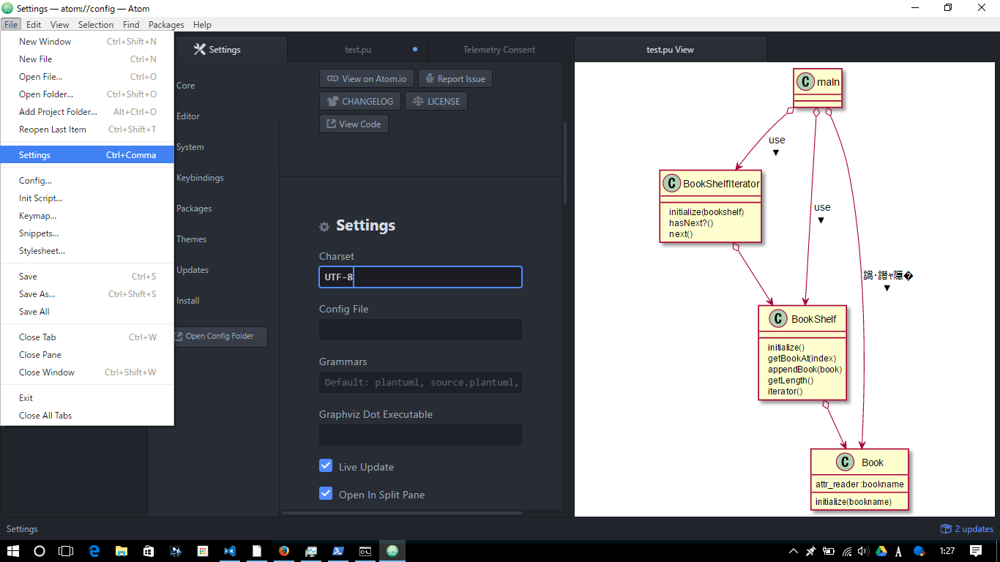

# markdown cheatseat

## 見出し

```markdown
# h1 Heading
## h2 Heading
### h3 Heading
```

### 見出しの基本ルール

基本的に、最初の行に#一つの見出し。  
後はコンテンツごとに##,###,####を使い分ける。

## 改行について

普通に改行しても反映されない。  

```markdown
1行目
2行目
```

１行目
２行目

### 改行するには

行末に半角スペース2つで改行

```markdown
1行目  <!-- ←半角スペースがふたつ入っている -->
2行目
```

1行目  
2行目

## 段落

空行を空ける

```markdown
1段落目

2段落目
```

1段落目

2段落目

## リスト

```markdown
* sample
* sample
  * sample
    * sample
      * sample
```

* sample
* sample
  * sample
    * sample
      * sample

## リスト(数字)

```markdown
1. sample
1. sample
1. sample
```

1. sample
1. sample
1. sample

## テーブル

```markdown
| 見出し | 見出し | 見出し | 見出し | 見出し |
| ---    | ---    | :--    | :--:   | --:    |
| 内容   | ないよ | 左     | 中     | 右     |
```

| 見出し | 見出し | 見出し | 見出し | 見出し |
| ---    | ---    | :--    | :--:   | --:    |
| 内容   | ないよ | 左     | 中     | 右     |

## コード表示(fences)

バッククォート３つで囲まれた範囲のことをfences code blockという。

```
``` # コードの種類を書く。
<tag>;&</tag> #tagもエスケープされて表示される。 
``` #ここまでがコードの範囲
```

行内で使う場合はバッククォート一つ。

```markdown
一行だと`<tag>test</tag>`

```

一行だと`<tag>test</tag>`

## コードにシンタックスハイライト

```markdown
```javascript <!-- コードの種類を書く。-->
function test(){
  var test = "test";
}
```           <!-- ここまでがコードの範囲-->
```

```javascript
function test(){
  var test = "test";
}
```

## リンク

### 外部へのリンク

以下の書き方を使う。

```markdown
## 文章を書くときに気をつけること

読み手の気持ちになって考える事。[*1][*1]

## 参考 

[リーダブルコード要約とリーダブルコード要約の活用方法][*1]

[*1]:http://qiita.com/AKB428/items/20e81ccc8d9998b5535d
```

読み手の気持ちになって考える事。[*1][*1]  
[リーダブルコード要約とリーダブルコード要約の活用方法][*1]

[*1]:http://qiita.com/AKB428/items/20e81ccc8d9998b5535d


### docs内のリンク

以下の書き方を使う。

```markdown
[マークダウン](./markdown.md)
```
[マークダウン](./markdown.md)

## 画像

```markdown
  
```

  

## 参考

[マークダウン記法まとめ][*2]  
[MASTERS GITHUB][*4]  
[ASSENMLE CHEATSHEET][*3]

[*2]:http://codechord.com/2012/01/readme-markdown/
[*3]:http://assemble.io/docs/Cheatsheet-Markdown.html
[*4]:https://guides.github.com/features/mastering-markdown/