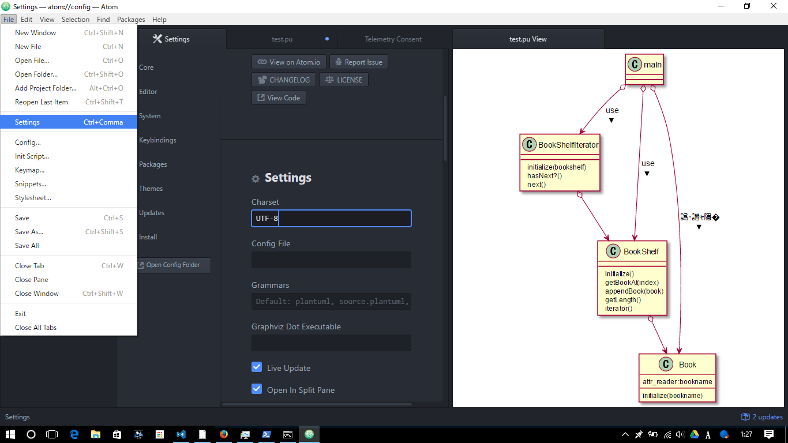

# ATOM

UMLの画像作成に使用。

## 使い方

インストールはwindowsの場合はdoc/devtools/windows/readme.mdを参照。

[ctrl]+[alt]+[p]でプレビュー画面を開く。

保存するときは.puの拡張子で保存する。

## 書き方

## 文字化けするとき

File > settings

Pcakagesのタブを選択

Plantuml-viewerのsettingを選択

UTF-8を入力

元の画面に戻って何か入力してみる。文字化けが直っていたら成功

  

## 参考

[クラス図を書く方法][*1]

[*1]:http://gabekore.org/atom-plantuml-class-diagram