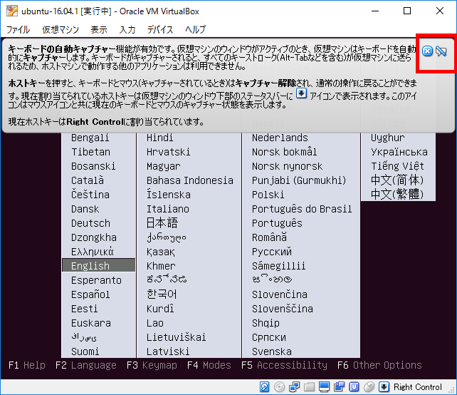
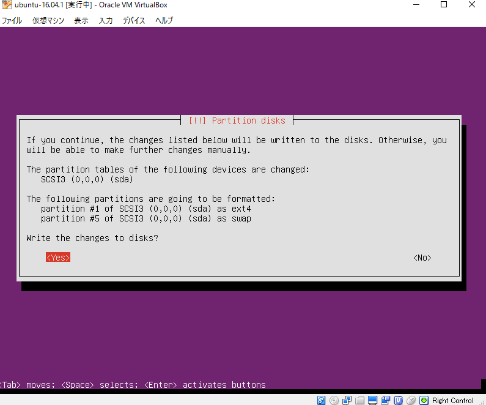

# ubuntu16.04のパッケーッジを作成する

bentoから配布されているものはvirtualbox5.0系である。  
vagrant1.8.6 + 5.1.8ではネットワークの設定が反映されない。  
さらに、bento/ubuntu-16.04のbox_version = "2.3.0"では、
起動に5分ほどかかるようになってしまった。  
` A start job is running for LSB: Raise network interfaces `
というメッセージでチェックが走っているようだ。

よって、新しく入れてみようと思う。

## 環境

* windows10 64bit
* vagrant1.8.6
* VirtualBox5.1.8

### 設定

virtual boxでの設定まとめ

|設定|値|
|--|--|
|名前|ubuntu-16.04.1|
|フロッピー|無効化|
|クリップボードの共有|双方向|
|メモリ|2048|
|ストレージ|32G|
|オーディオ｜無効化|
|grub|はい|

ubuntu インストール時設定

|設定|値|
|--|--|
|名前|ubuntu|
|ユーザーの本名|vagrant|
|ユーザ名|vagrant|
|password|vagrant|
|ホームディレクトリの暗号化|なし|
|パーティション|ガイド全体を使う|
|プロキシ|使わない|
|アップデート|自動でしない|
|ソフトウェア|standard system utilities, OpenSSH server|
|GRUB|はい|

## 手順ログ

### ubuntuのダウンロード

以下のサイトから[ ubuntu server 16.04.1 LTS ]をダウンロード。
自分の環境だと3時間程度かかった。  
[https://www.ubuntu.com/download/server](https://www.ubuntu.com/download/server)


### virtualboxを立ち上げ、新規作成


### 設定を行う

設定をクリックすると以下の画面が表示される。


一般 > 高度  
クリップボードの共有を双方向に


システム > マザーボード  
フロッピーのチェックを外す


オーディオ  
オーディオを無効化


### 起動


先程ダウンロードしたubuntuのディスクファイルを選択


起動を押すと、以下のようにインストール開始画面が開く。  
邪魔な説明は右上のバツボタンで閉じられる。  
マウスのポインタが見えなくなったら右側の[ctrl]
を押せという説明なのでそれを把握したら消して良い。



日本語だと文字化けすることがあるので英語でインストール。


ユーザ名とパスワードはvagrantにする


下の*はそこを選んだ状態で[space]でチェック可能.  
パスワードが見えるようになる





open sshに[space]でチェックをいれて[enter]


インストール完了

## インストール後の設定

ゲストOSのIPアドレスを調べる

```bash
$ ifconfig
```


VirtualBoxを開く

ネットワーク > アダプター1 > 高度な設定 > ポートフォワーディング  
VMの22番ポートをホスト側の任意のポートに割り当てる。


ホスト側でbashを立ち上げ、以下の情報でssh接続する。

```bash
$ ssh vagrant@127.0.0.1 -p 2222
```

`are you sure you want to continue connectiong?`には`yes`  
`password:`には`vagrant`  
接続できることを確認する


## システムの更新

インストール前に現在のソフトウェアを最新に更新

```bash
$ sudo apt-get update
$ sudo apt-get upgrade
```


## root設定

rootのパスワードを`vagrant`にする

```bash
$ sudo passwd root
```

`Enter new UNIX password:`  `vagrant`  
`Retype new UNIX password:` `vagrant`


変更したらrootになれることを確認

```bash
$ su -
```

パスワードに `vagrant`を入力


## sudoの設定

vagrantユーザの設定確認。  
sudoに所属していることを確認する。

```bash
$ id vagrant
```


このグループに対してパスワードなしで出来るように設定。

そのままだとnanoエディタが開くので、
vimを使いたい人は先にデフォルトのエディタの設定を変更する。

```bash
$ sudo update-alternatives --config editor
```
3 [enter]でvim.basicを選択


これでvimに変更できた。

```bash
$ sudo visudo
```

「/etc/sudoer」の以下の行を変更する。

```bash
%sudo    ALL=(ALL:ALL) ALL
    ↓
%sudo   ALL=(ALL) NOPASSWD:ALL
```


変更後、一度ログアウトして再度接続。  
パスワードなしでsudoできることを確認。

```bash
$ exit
$ exit
$ ssh vagrant@127.0.0.1 -p 2222
$ sudo -s
```


## ssh設定

カギ格納用のディレクトリを作成。

```bash
$ mkdir ~/.ssh
$ chmod 0700 ~/.ssh
```


vagrantユーザ用の公開カギを取得。

```bash
$ cd ~/.ssh
$ wget --no-check-certificate 'https://raw.github.com/mitchellh/vagrant/master/keys/vagrant.pub' -O authorized_keys
```


vagrantユーザに権限を設定する

```bash
$ chmod 600 ~/.ssh/authorized_keys
$ chown -R vagrant ~/.ssh
```

## sshd設定

dns参照を防ぐ

```bash
$ sudo vim /etc/ssh/sshd_config
```

末尾に`UseDNS no`を追加


設定後sshd再起動

```bash
sudo service ssh restart
```

## ソフトウェアのインストール

カーネルヘッダとビルドツールのインストール

```bash
$ sudo apt-get install -y linux-headers-$(uname -r) build-essential
```
少し時間がかかります。

## VirtualBox Guest Addtitionのインストール

[virtual box guest addtion](http://download.virtualbox.org/virtualbox/)のHPから
Guest Additionsをダウンロード。


GuestAdditionのイメージを挿入する。


マウント後、インストールを行う

```bash
$ sudo mount /dev/cdrom /media/cdrom
$ sudo sh /media/cdrom/VBoxLinuxAdditions.run
```


仮想ドライブからイメージを除去。  
今回は除去がうまくいかず強制排出した。


## 掃除

掃除をしてシャットダウン

```bash
$ sudo dd if=/dev/zero of=/EMPTY bs=1M
$ sudo rm -f /EMPTY
$ sudo shutdown -h now
```


## パッケージ化

```bash
$ vagrant package --base ubuntu-16.04.1
```


## 登録・確認

```bash
$ vagrant box add hibohiboo/ubuntu-16.04.1 package.box
$ vagrant box list
```


## 確認

```bash
$ mkdir test
$ cd test
$ vagrant init hibohiboo/ubuntu-16.04.1
$ vagrant up
```


## 作り直すとき

削除してから同様の手順

```bash
$ vagrant box remove hibohiboo/ubuntu-16.04.1
```


## 参考

[windowsのvagrant boxｗ作る][*1]
[ubuntuをインストール][*2]
[ubuntu14.04のvagrantboxを作る][*3]
[手作業でつくってみた][*4]
[ubuntuをインストールしたときにしたこと][*5]
[ubuntu Server][*6]
[ubuntu server 16.04][*7]
[変nano][*8]
[vim][*9]
[insecure key pair][*10]

[*1]:http://qiita.com/kutsushitaneko/items/4d37237808cbc165f6b0
[*2]:http://qiita.com/ykawakami/items/4bae371932110b2e25e3
[*3]:http://zow.hatenablog.com/entry/20150131/1422683459
[*4]:http://www.deer-n-horse.jp/linux/diary/?date=20140411
[*5]:http://qiita.com/cyclon2joker/items/91d5f324d9edfde6e3db
[*6]:https://www.ubuntu.com/download/server
[*7]:https://www.server-world.info/query?os=Ubuntu_16.04&p=install
[*8]:http://takuya-1st.hatenablog.jp/entry/20110423/1303585363
[*9]:http://qiita.com/b4b4r07/items/f7a4a0461e1fc6f436a4
[*10]:https://github.com/mitchellh/vagrant/tree/master/keys
[*11]:http://unix.stackexchange.com/questions/309616/how-to-disable-requiretty-on-ubuntu-16-04

