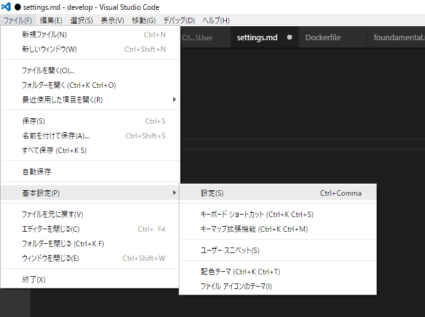
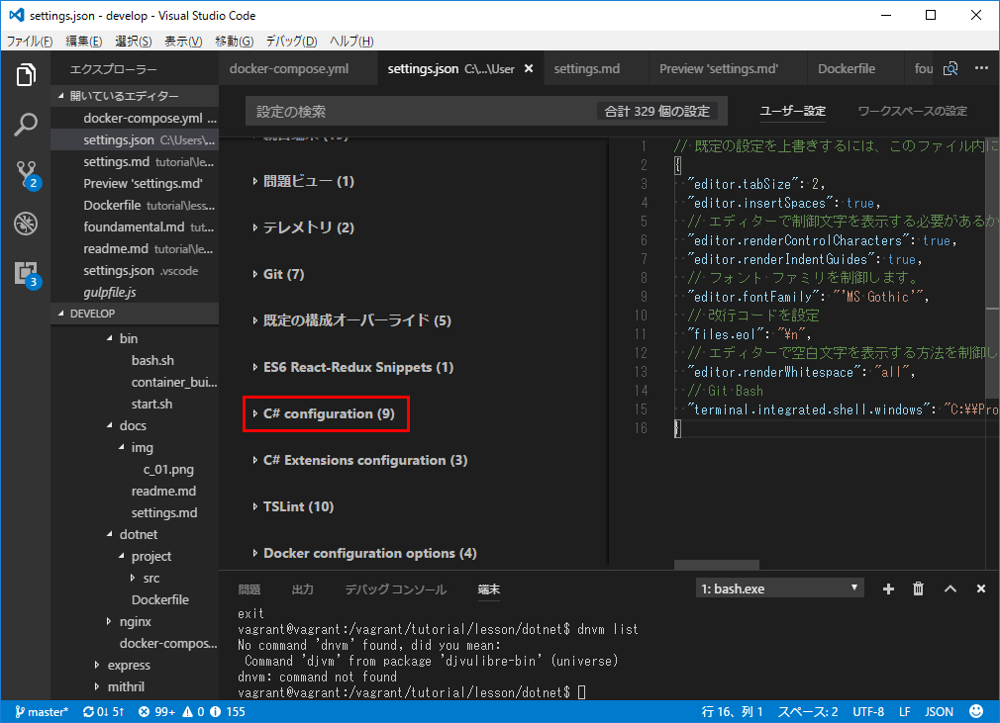
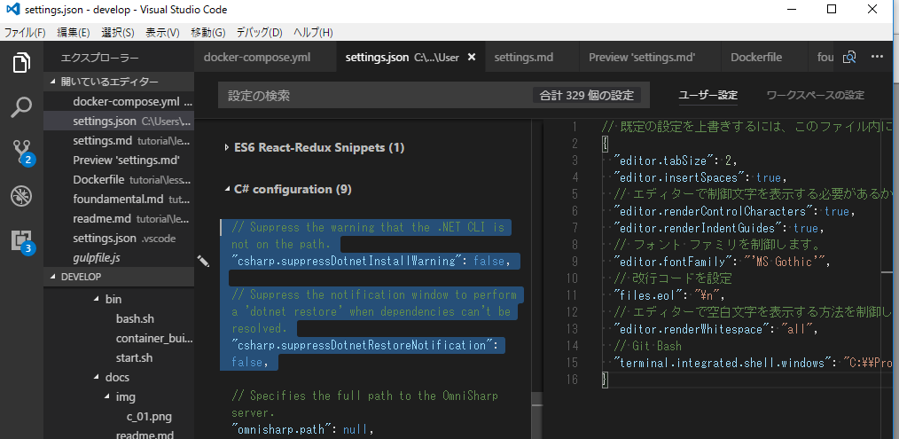
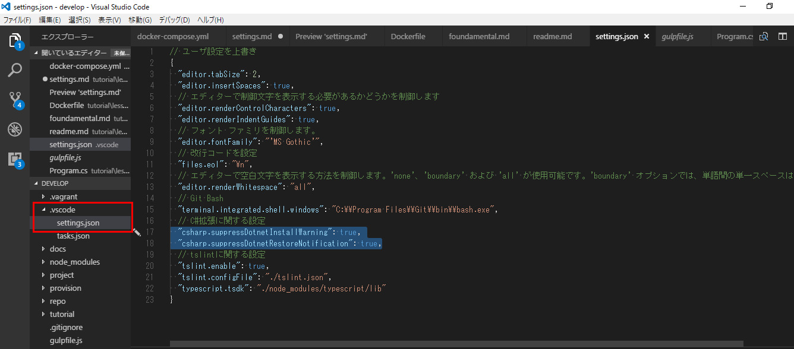

# dotnet開発用設定

## 環境

* windows10
* visual studio code

## vscodeの環境設定

設定を開く

C#の設定を開く

C#の設定を確認し、変更したい部分をコピー

`.vscode/settings.json`ファイルに貼り付けて、自分の設定で上書き

## 参考

[sdk][*1]

[*1]:https://www.microsoft.com/net/download/core