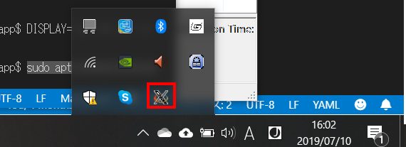

## xserverを使った接続確認

### windows側

#### ssh

windows側でssh接続

```
$ ssh docker@192.168.50.10 -p 10022
```

#### xserver

##### インストール

```
cinst -y vcxsrv
```

インストール後、［スタート］メニューの［VcXsrv］－［XLaunch］で起動。
デフォルト設定のまま起動。バーにxserverが追加されたことを確認。


#### ip確認

コマンドプロンプトを立ち上げて、 `ipconfig`コマンドを確認。

```
イーサネット アダプター イーサネット 3:

   接続固有の DNS サフィックス . . . . .:
   IPv4 アドレス . . . . . . . . . . . .: 192.168.33.1
   サブネット マスク . . . . . . . . . .: 255.255.255.0
   デフォルト ゲートウェイ . . . . . . .:
```


### vagrant上のubuntuからwindowsのxserverの起動確認

上記で確認したIPを入力して動作を確認。

```
sudo apt install x11-apps
DISPLAY=192.168.33.1:0.0 xeyes
```

### vagrant上のubuntuからwindowsのxserverの起動確認

上記で確認したIPを入力して動作を確認。

```
sudo apt install x11-apps
DISPLAY=192.168.33.1:0.0 xeyes
```


### docker上からのwindowsのxserverの起動確認

#### vagrantでdockerの起動

```
cd /vagrant/tutorial/lesson/electron/electron_first_app
./bin/up.sh
```

#### windowsのxserverにvscodeを流す

上記でdockerが起動している状態が前提。

##### vagrant上から起動

```
cd /vagrant/tutorial/lesson/electron/electron_first_app
./bin/vscode.sh
```

##### windows上から起動

```
$ ssh docker@192.168.50.10 -p 10022
```

パスワードを入力してログインをした後、以下を入力

```
DISPLAY=192.168.33.1:0.0 code /app
```

[この時点のソース](https://github.com/hibohiboo/develop/tree/d4414d4c275fc680ea51ed27adb216262416b314/tutorial/lesson/electron/electron_first_app)


## 参考

[Electronの開発環境をDocker上に作ってエラーに対処する](https://blog.hiroaki.home.group.jp/2016/11/electrondocker.html)
[UbuntuにVSCodeをインストールする3つの方法](https://qiita.com/yoshiyasu1111/items/e21a77ed68b52cb5f7c8)
[WSL上にXサーバをインストールしてGUIを実現する（VcXsrv編）](https://www.atmarkit.co.jp/ait/articles/1812/06/news040.html)
[chocolatey](https://chocolatey.org/packages/vcxsrv)
[DockerでXサーバを動かしてGUIを直接表示する](https://kunst1080.hatenablog.com/entry/2018/03/18/225102)
[WSLでvue-cli3 + electron](https://qiita.com/MssKnd/items/062b417daa57868db4d2)
[GUI application を docker で起動する](https://attonblog.blogspot.com/2018/04/docker-with-x11.html)
[ElectronをWindowsのBash(WSL)で試してみて成功しなかった](http://igatea.hatenablog.com/entry/2018/02/11/004142)
[Vagrantの環境でGUIを立ち上げるための環境構築](http://msyksphinz.hatenablog.com/entry/2015/11/24/020000)
[Dockerコンテナの中でGUIアプリケーションを起動させる](https://unskilled.site/docker%E3%82%B3%E3%83%B3%E3%83%86%E3%83%8A%E3%81%AE%E4%B8%AD%E3%81%A7gui%E3%82%A2%E3%83%97%E3%83%AA%E3%82%B1%E3%83%BC%E3%82%B7%E3%83%A7%E3%83%B3%E3%82%92%E8%B5%B7%E5%8B%95%E3%81%95%E3%81%9B%E3%82%8B/)
[sshコマンドでパスワードをオプションとして入力出来るようにする『sshpass』](https://orebibou.com/2015/01/ssh%E6%8E%A5%E7%B6%9A%E3%81%A7%E3%83%91%E3%82%B9%E3%83%AF%E3%83%BC%E3%83%89%E3%82%92%E3%82%AA%E3%83%97%E3%82%B7%E3%83%A7%E3%83%B3%E3%81%A8%E3%81%97%E3%81%A6%E5%85%A5%E5%8A%9B%E5%87%BA%E6%9D%A5/)
[Vagrantのネットワーク周りのあれこれ](http://labs.septeni.co.jp/entry/20140707/1404670069)
