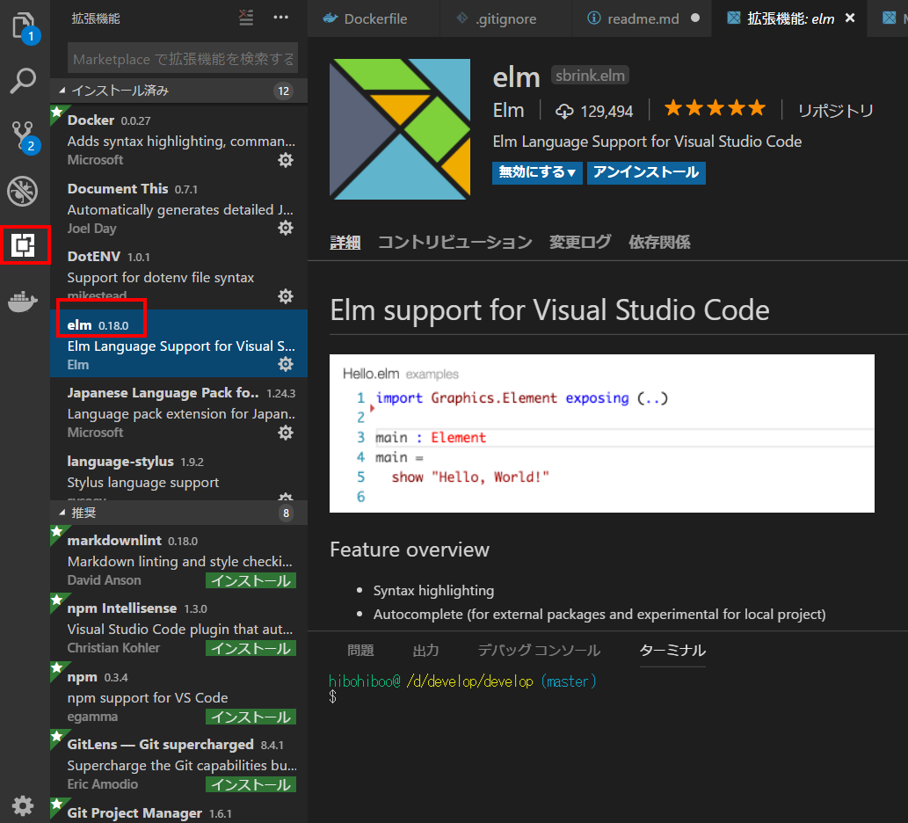

# チュートリアル

## 開発準備

### 動作環境
* os
  * windows10
* ホスト開発環境
  * chocolaty v0.10.11
  * visual studio code 1.24.0
  * node.js 10.5.0
* 仮想環境
  * vagrant2.1.1
  * virtualbox5.2.12
  * ubuntu-18.04
  * Docker version 18.05.0-ce, build f150324
  * docker-compose version 1.21.2, build a133471

### package.json

まず、elmをインストールする。

```bash
npm init
npm install --save elm elm-format
```

以下package.jsonを一部抽出。

```json
{
  "devDependencies": {
    "elm": "^0.18.0",
    "elm-format": "^0.6.1-alpha"
  }
}
```

### vscodeの設定
拡張機能のelmをインストール。



#### setting.json

* 保存したときにフォーマットが効く

```json
{
  "[elm]": {
    "editor.formatOnSave": true
  },
  "elm.formatCommand": ".\\node_modules\\.bin\\elm-format",
  "elm.makeCommand": ".\\node_modules\\.bin\\elm-make",
}
```
3a93bc6b1b300ddcb32d2f98266dd836c3c63c54 


### elm-workshopの準備

```
git clone https://github.com/rtfeldman/elm-workshop.git --depth 1
```


## 参考

[初学者がelm-workshopを通じてElmを学ぶ][*1]
[vscode-elm][*2]
[Docker と node_modules と Volume Trick][*3]
[DockerでのNodeアプリ構築で学んだこと][*4]

[*1]:https://qiita.com/akameco/items/a4b848c89ec7957d24be
[*2]:https://marketplace.visualstudio.com/items?itemName=sbrink.elm
[*3]:https://shotat.hateblo.jp/entry/2016/12/01/221631
[*4]:https://postd.cc/lessons-building-node-app-docker/