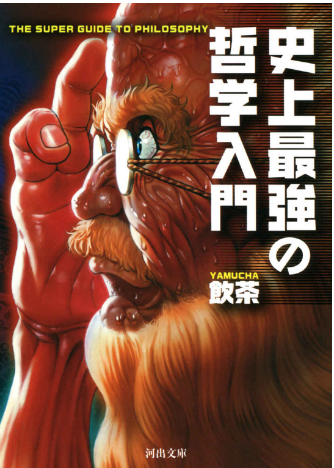
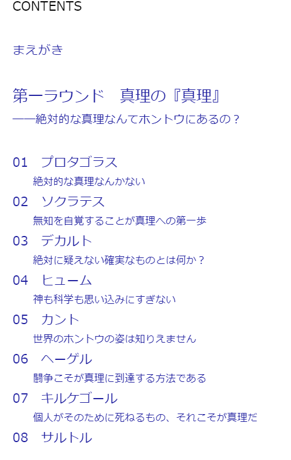
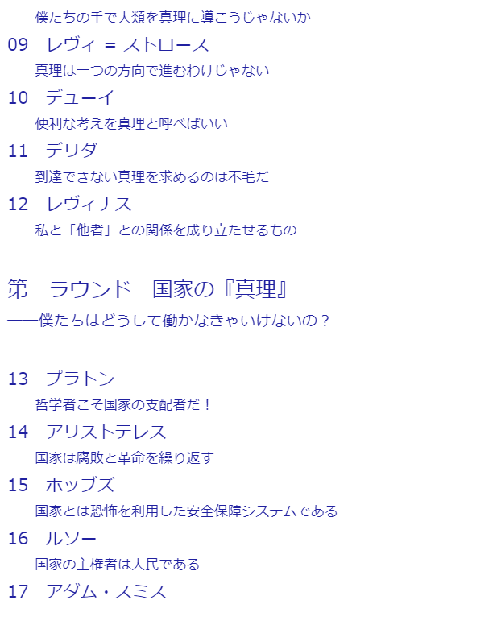
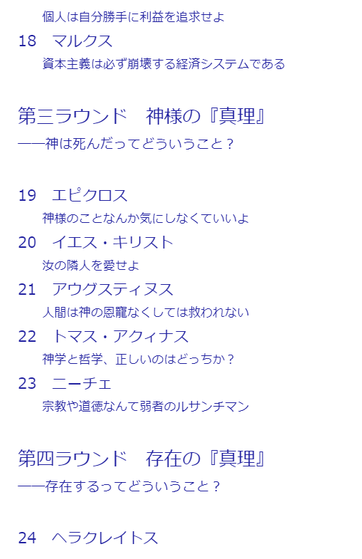
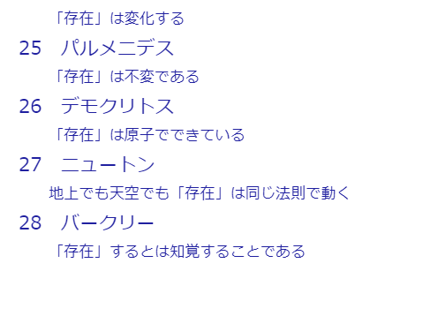

## 哲学の　AKI

---

## 経緯

---

## 秋の夜長

---

## 読書の秋

---

## やること
* 最近読んだ哲学の入門本が面白かったのでご紹介

---

---

## まえがきより
* 哲学を学ぼうとして何度も挫折した人向け
* 30人くらいを順に紹介していく
* 気軽に読める入門書

---

## まえがきより
* 簡単にできるやろ
* できない。どこかでみた定番に。。。
* 何が足りないのか

---

# 「バキ」分 {.fragment .grow}
## が足りなかった
* まえがきより

---

## 哲学の　AKI

---

## 哲学のBAKI

---

哲学の聖地、東京ドーム地下討議場

---

## 「史上最高の真理を
##  知りたいか！」

---

## 「おおおおおおお！！」

---

## 「全哲学者入場！」

---

### 神殺しは生きていた！

---

### 更なる研鑽を積み
### 人間狂気が蘇った！

---

## 超人!!

---

## ニーチェだァ―――！！

---

# 近代哲学は

---

# すでに

---

## 私が完成している！

---

## ヘーゲルだァ―――！！

---

## 続きは書籍で
* 32人分の哲人入場

---

## 名勝負のご紹介
* すべての議論が大議論ッッ！{.fragment .fade-up}
* すべての問答が名問答ッッ！{.fragment .fade-up}
* だがあえて一つご紹介ッッ！{.fragment .fade-up}

---

### 第一ラウンド
## 真理の『真理』
――絶対的な真理なんてホントウにあるの？

---

真理を目指して何が悪い！

人間として生まれたからには  
誰だって一度は、「絶対的真理」を求める。

「真理」など一瞬たりとも夢見たことがない、  
そんな人間はひとりとしてこの世に存在しない！

---

# 古代

---

# 宿命バトル

---

# 相対

---
# VS
---
# 絶対
---

### 論戦不敗【相対主義】
## プロタゴラス
---
# VS
---
### 最強論客【無知の知】
## ソクラテス

---

## 相対主義
### 絶対的な真理なんてない
### 価値観は人それぞれ

---

## 当時(B.C 400)
### 政治家にバカウケ

---

## 公開討論
* 古代ギリシャの習慣
* 広場に集う民衆
* 政治家同士の議論バトル
* 最強カード「相対主義」
  * 「価値」の基準をずらす

---

* 自分の主張は素晴らしく
* 相手の主張はひどい主張に

---

「地方の弱小国家を攻め滅ぼして奴隷としたい」

---

「文明から取り残された可哀そうな未開人を
聡明なギリシャ人が救ってやるのだ」

---

「なんて非人道的な！

自分の家族に置き換えてごらん。

キミは同じことができるのかい！」

---

## 衆愚政治
* クチのうまい扇動家
* なんとなくの多数決

---

## 最強論客ソクラテス
### 相対主義へのカウンターカード
## 【無知の知】

---

## 攻め側に回り続ける
* バカのふりをして、質問をし続ける
  * 「今正義っていった？正義って何？」
  * 「幸せになること?幸せって何？」
* 相手の手札を吐かせきる
  * いつか答えに詰まるまで質問する

---

「答えられないってことは、

あなたはそれを知らないんですね」

---

「知らないのに今まで語っていたんですね（笑）」

---

## 政治家たちを論破
* ただし金にはならず
* 恨みを買うだけ

---

## 何故？

---

## 真理
* ただ、真理を追い求めたかった
* 若者の心を揺さぶり、弟子が多数できる

---

## 死刑

### 若者を堕落させた罪

---

## ここから始まる真理の探究
* ソクラテスの死後、弟子たちが真理を追い求めていく

---

## まとめ
* 史上最強の哲学入門、おすすめ
* 当時の時代背景を含めて、順番に進んでいくので分かりやすい

---

## 参考
[史上最強の哲学入門](https://www.amazon.co.jp/%E5%8F%B2%E4%B8%8A%E6%9C%80%E5%BC%B7%E3%81%AE%E5%93%B2%E5%AD%A6%E5%85%A5%E9%96%80-%E9%A3%B2%E8%8C%B6-ebook/dp/B01JA1LEZO/ref=sr_1_1?adgrpid=108934551030&dchild=1&gclid=CjwKCAjw2bmLBhBREiwAZ6ugo-CiOOZcI-MmHY1mC-uZ2cA3EBFJOIbUHeNziMsSKV7_FVSE53AHehoCc8MQAvD_BwE&hvadid=553984468703&hvdev=c&hvlocphy=1009461&hvnetw=g&hvqmt=e&hvrand=10829817233041268520&hvtargid=kwd-782981092548&hydadcr=27488_14478954&jp-ad-ap=0&keywords=%E5%8F%B2%E4%B8%8A+%E6%9C%80%E5%BC%B7+%E3%81%AE+%E5%93%B2%E5%AD%A6+%E5%85%A5%E9%96%80&qid=1634659393&sr=8-1)

[史上最強の哲学入門 東洋の哲人たち](https://www.amazon.co.jp/%E5%8F%B2%E4%B8%8A%E6%9C%80%E5%BC%B7%E3%81%AE%E5%93%B2%E5%AD%A6%E5%85%A5%E9%96%80-%E6%9D%B1%E6%B4%8B%E3%81%AE%E5%93%B2%E4%BA%BA%E3%81%9F%E3%81%A1-%E6%B2%B3%E5%87%BA%E6%96%87%E5%BA%AB-%E3%82%84-33-2/dp/4309414818/ref=sr_1_2?adgrpid=108934551030&dchild=1&gclid=CjwKCAjw2bmLBhBREiwAZ6ugo-CiOOZcI-MmHY1mC-uZ2cA3EBFJOIbUHeNziMsSKV7_FVSE53AHehoCc8MQAvD_BwE&hvadid=553984468703&hvdev=c&hvlocphy=1009461&hvnetw=g&hvqmt=e&hvrand=10829817233041268520&hvtargid=kwd-782981092548&hydadcr=27488_14478954&jp-ad-ap=0&keywords=%E5%8F%B2%E4%B8%8A+%E6%9C%80%E5%BC%B7+%E3%81%AE+%E5%93%B2%E5%AD%A6+%E5%85%A5%E9%96%80&qid=1634659393&sr=8-2)

---

---

---

---

