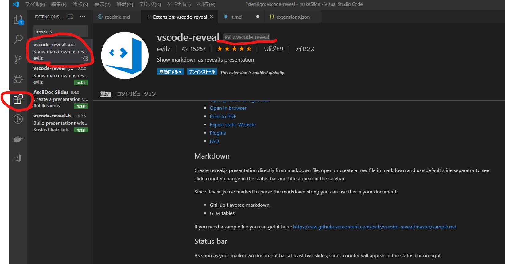
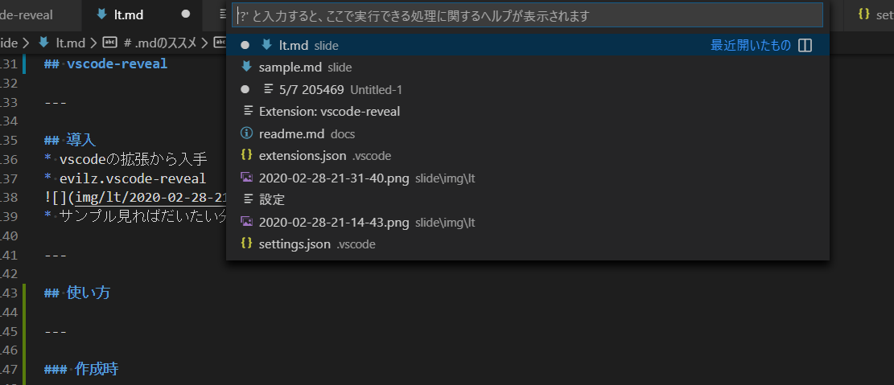
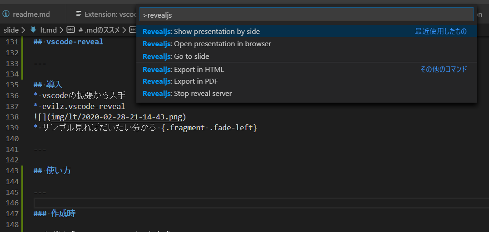
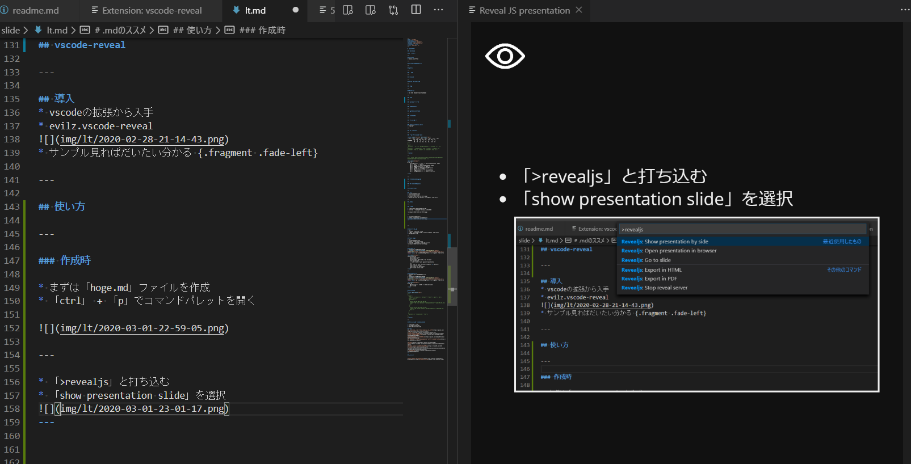
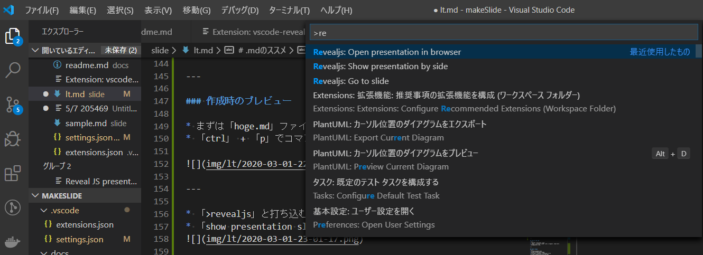
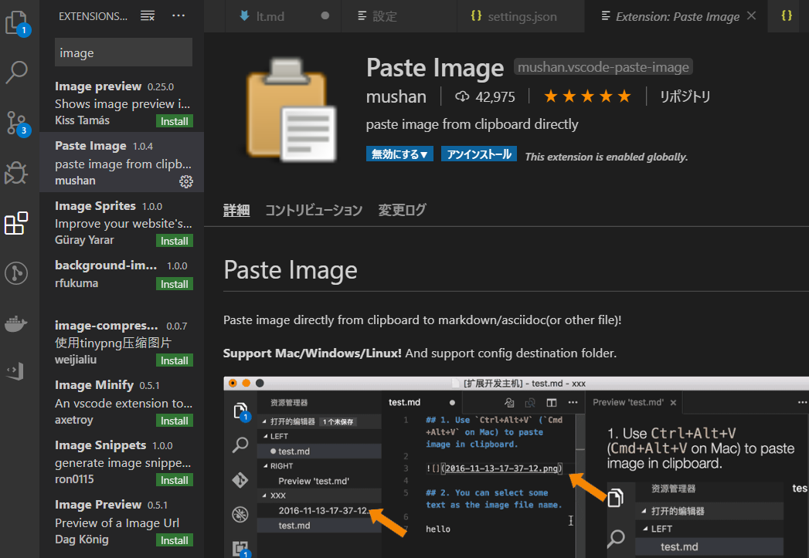

# .mdのススメ

### ZeroScope

#### 加藤 久和

---

## やること
* Reveal.jsのご紹介

---

## スライドといえばパワポ

---

## ですが

---

### ムズい

---

## メンドい

---

## Gitで差分わからない

---

### ので

---

## Reveal.js

* THE HTML PRESENTATION FRAMEWORK

---

### HTML

---

### markdown形式も可

---

### ということは

---

### デザインセンス不要

---

### Git管理可能

---

### (´・ω・｀) ?

---

### https://revealjs.com/#/
* 完璧なデモ

---

### ちょっと紹介

---

### モバマス総選挙順位遷移

<canvas class="stretch" data-chart="bar">
,第1回, 第2回, 第3回, 第4回, 第5回, 第6回, 第7回, 第8回
    ,     125, 150, 168, 149, 154,  165, 163, 175
高森藍子,   3,   3,   3,   3,   3,   3,     3,  3
    ,      20,  15,  12,  34,  29,  18,   20,  15
<!-- 
{
"data" : {
"datasets" : [{ }, { "backgroundColor": "#ffa500" }, {  } ]
},
"options": { "responsive": true, "scales": { "xAxes": [{ "stacked": true }], "yAxes": [{ "stacked": true }] } }
}
-->
</canvas>

---

<!-- .slide: data-transition="slide" data-background="#ffffff" data-background-transition="zoom" -->

graph TB
    ID1[目指すなら] -- No.1 --> ID2[春のイベントと言えば]
    ID1 -- Only.1 --> ID22[ ]
    ID2 -- お花見 --> ID4[冬のイベントと言えば]
    ID2 -- エイプリルフール --> ID42[ ]
    ID4 -- お正月 --> ID5[結婚式を挙げるなら]
    ID4 -- クリスマス --> ID52[ ]
    ID5 -- 森で動物に囲まれ --> ID6[高森藍子]
    ID5 -- お城で人に囲まれ --> ID62[西園寺琴歌]
    

 

---

### HTML書くの面倒では？

---

### VS Codeの拡張で簡単

---

## vscode-reveal

---

## 導入
* vscodeの拡張から入手
* evilz.vscode-reveal

* サンプル見ればだいたい分かる {.fragment .fade-left}

---

## 使い方

---

### 作成時のプレビュー

* まずは「hoge.md」ファイルを作成
* 「ctrl」 + 「p」でコマンドパレットを開く

---

* 「>revealjs」と打ち込む
* 「show presentation slide」を選択

---

---

### 出力時
* コマンドパレットで「>revealjs: Open presentation in browser」

---

## 知ってました？
* 脱線
* 「Win」+ 「Shift」+ 「s」
* 画面の一部のスクリーンショット {.fragment .fade-left}
* 私は最近知りました

---

## Paste Image
* 脱線
* vscodeの拡張から入手
* mushan.vscode-paste-image
* 「ctrl」 + 「alt」 + 「v」 で画像貼付

---

## キーボードショートカットとか
* 本流
* 「shift」 + 「?」
* フルスクリーン「f」
* スピーカーノート 「s」

---

## 参考
[これからのプレゼン資料は reveal.js を使おう](https://qiita.com/Targityen/items/40ae4795e2cb77c1adc6)
[reveal.js](https://github.com/hakimel/reveal.js/)
[お手軽reveal.js入門](https://jyun76.github.io/revealjs-vscode/)
[reveal.jsでスライド作り。](https://qiita.com/t-kusakabe/items/725e7438892bba395062)
[【翻訳】reveal.js - README.md](https://qiita.com/takayu90/items/0af9bd125e6704803c0d)
[VS Codeを極める！ MarkdownやGitにもオススメの拡張機能9選](https://ics.media/entry/18756/)
[スライドはPowerPointだけじゃない。](http://www-toralab.ics.nitech.ac.jp/~konyu/c1.html)

[mermaid](https://mermaid-js.github.io/mermaid/#/)
[chart](https://github.com/rajgoel/reveal.js-plugins/tree/master/chart)
[mermaid.jsのフローチャートの書き方](https://ryuta46.com/516)
[総選挙](https://dic.nicovideo.jp/a/%E3%82%B7%E3%83%B3%E3%83%87%E3%83%AC%E3%83%A9%E3%82%AC%E3%83%BC%E3%83%AB%E7%B7%8F%E9%81%B8%E6%8C%99)
[診断チャート](https://twitter.com/kyow_no/status/1121788776735367171)
[コロナまとめ](https://toyokeizai.net/sp/visual/tko/covid19/)
---

## 使用画像

[Icons made by Kiranshastry](https://www.flaticon.com/authors/kiranshastry) from [www.flaticon.com](https://www.flaticon.com/)