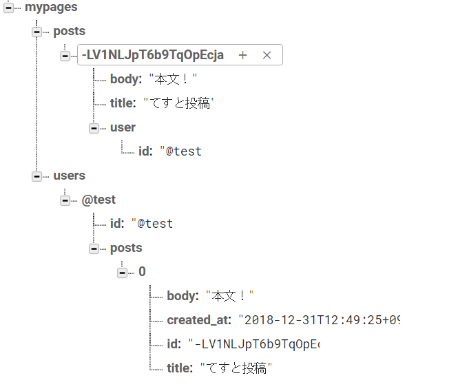
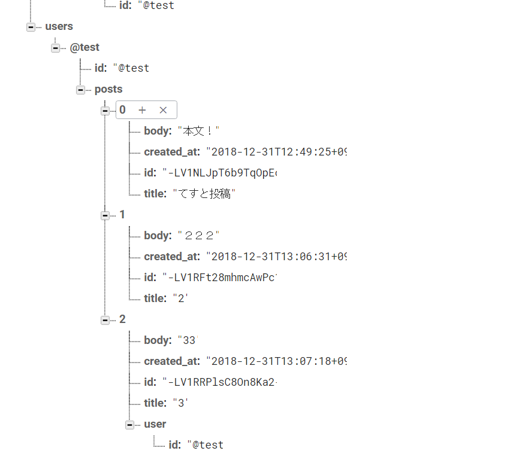

# blog

## 環境作成

* これまでやっていたページはいったん削除

[この時点のソース](https://github.com/hibohiboo/wasureta/tree/f1d8125275963521c0ecd7fcd0147c7d4120f020/nuxt)

## スキャフォールディング

### プロジェクトの作成

* 91Pの手順に従ってインストール
* yarn までやってくれたので、案の定エラー。

```
vagrant@vagrant[master]:/vagrant/project/wasureta/nuxt$ ./bin/blogs/create-project.sh
> Generating Nuxt.js project in /app/src/mypage
? Project name mypage
? Project description my first-rate Nuxt.js project
? Use a custom server framework none
? Use a custom UI framework element-ui
? Choose rendering mode Universal
? Use axios module yes
? Use eslint yes
? Use prettier yes
? Author name hibo
? Choose a package manager yarn
Initialized empty Git repository in /app/src/mypage/.git/
yarn install v1.12.3
info No lockfile found.
[1/4] Resolving packages...
warning eslint > file-entry-cache > flat-cache > circular-json@0.3.3: CircularJSON is in maintenance only, flatted is its successor.
[2/4] Fetching packages...
info fsevents@1.2.4: The platform "linux" is incompatible with this module.
info "fsevents@1.2.4" is an optional dependency and failed compatibility check. Excluding it from installation.
[3/4] Linking dependencies...
warning " > element-ui@2.4.11" has unmet peer dependency "vue@^2.5.2".
warning " > eslint-loader@2.1.1" has unmet peer dependency "webpack@>=2.0.0 <5.0.0".
warning " > eslint-plugin-vue@4.7.1" has incorrect peer dependency "eslint@^3.18.0 || ^4.0.0".
error An unexpected error occurred: "EPROTO: protocol error, symlink '../../../parser/bin/babel-parser.js' -> '/app/src/mypage/node_modules/@babel/core/node_modules/.bin/parser'".
info If you think this is a bug, please open a bug report with the information provided in "/app/src/mypage/yarn-error.log".
info Visit https://yarnpkg.com/en/docs/cli/install for documentation about this command.

  To get started:

    cd mypage
    yarn run dev

  To build & start for production:

    cd mypage
    yarn run build
    yarn start
```

### yarnのやりなおし

* docker-composeを書き換えて、やりなおし。

```
vagrant@vagrant[master]:/vagrant/project/wasureta/nuxt$ ./bin/blogs/first-install-package.sh
yarn install v1.12.3
info No lockfile found.
[1/4] Resolving packages...
warning eslint > file-entry-cache > flat-cache > circular-json@0.3.3: CircularJSON is in maintenance only, flatted is its successor.
[2/4] Fetching packages...
info fsevents@1.2.4: The platform "linux" is incompatible with this module.
info "fsevents@1.2.4" is an optional dependency and failed compatibility check. Excluding it from installation.
[3/4] Linking dependencies...
warning " > element-ui@2.4.11" has unmet peer dependency "vue@^2.5.2".
warning " > eslint-loader@2.1.1" has unmet peer dependency "webpack@>=2.0.0 <5.0.0".
warning " > eslint-plugin-vue@4.7.1" has incorrect peer dependency "eslint@^3.18.0 || ^4.0.0".
[4/4] Building fresh packages...
success Saved lockfile.
Done in 29.41s.
```

[この時点のソース](https://github.com/hibohiboo/wasureta/tree/dfd16f5ca97101e14a0da9072fda9026a2001442/nuxt)

## 起動

* docker用のポーリング設定をnuxt.config.jsに行って起動

```
vagrant@vagrant[master]:/vagrant/project/wasureta/nuxt$ ./bin/up.sh
Starting docker_nuxt_1 ... done
Attaching to docker_nuxt_1
nuxt_1  | yarn run v1.12.3
nuxt_1  | $ nuxt
nuxt_1  | ℹ Preparing project for development                                   01:04:52
nuxt_1  | ℹ Initial build may take a while                                      01:04:52
nuxt_1  | ✔ Builder initialized                                                 01:04:52
nuxt_1  | ✔ Nuxt files generated                                                01:04:52
nuxt_1  | ℹ Compiling Client                                         webpackbar 01:04:53
nuxt_1  | ℹ Compiling Server                                         webpackbar 01:04:53
nuxt_1  | ✔ Server: Compiled successfully in 8.11s                   webpackbar 01:05:01
nuxt_1  | ✔ Client: Compiled successfully in 9.60s                   webpackbar 01:05:02
nuxt_1  | ℹ Waiting for file changes                                            01:05:02
nuxt_1  | ℹ Listening on: http://172.18.0.2:3000                                01:05:02
╚Gracefully stopping... (press Ctrl+C again to force)
Stopping docker_nuxt_1 ... done
```
[この時点のソース](https://github.com/hibohiboo/wasureta/tree/e01765b2d79a145c5aeacd3668ac5e617fee6933/nuxt)

## ログインページの作成

### モック作成

[この時点のソース](https://github.com/hibohiboo/wasureta/tree/e2d78ad2c26a5aea00ccdbad499cdb3079ae7651/nuxt)

### 簡易的なログイン作成

[この時点のソース](https://github.com/hibohiboo/wasureta/tree/b4512f91816934dbcddd2c0a8cd7b73b9f9177fa/nuxt)


### cookieによる永続化

[この時点のソース](https://github.com/hibohiboo/wasureta/tree/b27eb2a1084931663857050a221432fd5491064c/nuxt)

### グローバルナビゲーションでのログイン確認

[この時点のソース](https://github.com/hibohiboo/wasureta/tree/c072e1231f40ae20cb37df8f5022a0232f4aa6a1j/nuxt)

## 投稿機能の実装

* 試しに投稿したときのデータベースの様子は以下。



[この時点のソース](https://github.com/hibohiboo/wasureta/tree/628bda0623780eacc186c0a735b11a9edd88503b/nuxt)

### 注意点

```js
  async publishPost({ commit }, { payload }) {
    const user = await this.$axios.$get(
      `/mypages/users/${payload.user.id}.json`
    )
    // firebaseが割り宛てたランダムな英字の投稿データIDを取得する
    const post_id = (await this.$axios.$post('/mypages/posts.json', payload))
      .name
    const created_at = moment().format()
    const post = { id: post_id, ...payload, created_at }
    const putData = { id: post_id, ...payload, created_at }
    // 以下のdeleteを忘れると、userの下の投稿の下にさらにuserができることとなる。
    delete putData.user
    await this.$axios.$put(`/mypages/users/${user.id}/posts.json`, [
      ...(user.posts || []),
      putData
    ])
    commit('addPost', { post })
```

* deleteを忘れた場合、以下のようなDBとなる。



## 投稿一覧

* 投稿日時が登録されていなかったので、posts.jsで投稿日時を登録するように更新の手順を増やした。


[この時点のソース](https://github.com/hibohiboo/wasureta/tree/83d0fede4748c3f2c9a6fd8a206147255fc21b99/nuxt)


## 詳細ページを表示

* lint的には computedよりfiltersのほうが上にあるほうがよいということなので、順番だけ変更

[この時点のソース](https://github.com/hibohiboo/wasureta/tree/8b0b5d446f3faf890b9527861dec3247ceede4b0/nuxt)

## ユーザページを表示

[この時点のソース](https://github.com/hibohiboo/wasureta/tree/f73579caa91a1a7c8b25840a95ed769d551dc57d/nuxt)


## いいね機能の追加

[この時点のソース](https://github.com/hibohiboo/wasureta/tree/7fcb611e659a53412b84c8464a2117982ec04aa3/nuxt)

## バリデーション追加

[この時点のソース](https://github.com/hibohiboo/wasureta/tree/89ea3b341701bb48286e873e7ebb7890971b7752/nuxt)


## 参考

[Nuxt.js ビギナーズガイド][*0]
[スタイルガイド][*1]

[*0]:https://nuxt-beginners-guide.elevenback.jp/examples/
[*1]:https://jp.vuejs.org/v2/style-guide/