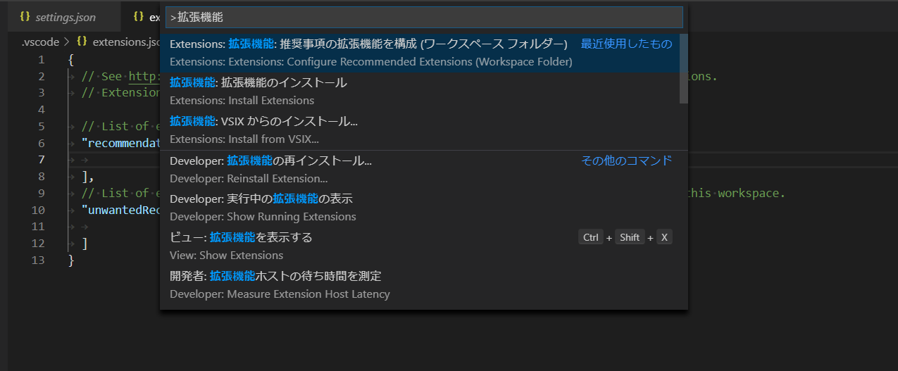

## npm 依存ライブラリ

### server

```
npm i --save express
```

```
npm i --save-dev @types/express
```

#### パース

```
npm i --save body-parser
```

## npm 開発用ライブラリ

### typescript

```
npm i --save-dev typescript
```

#### tsconfig 準備

```console
npx tsc --init
```

### typescript トランスパイル - サーバテスト

```
npm i --save-dev ts-node ts-node-dev
```

### テストツール

```
npm i --save-dev ts-jest @types/jest @types/supertest
```

## vscode インストール プラグイン

コマンドパレット([ctrl]+[shift]+[p])をひらいて、拡張機能で検索

- 拡張機能：推奨条項の拡張機能を構成（ワークスペースフォルダ）を選択。

extension.json が作成されるので、ID を列挙。



### REST Client

- POST リクエストの応答を確認

#### 使い方

client.http のエディタ上で右クリックメニューを開き[Send Request]

### テスト用ツール Jest

- カバレッジ出力
- テスト参考

  - https://github.com/sakkuru/API-Server-chapter3

### フォーマットのインストール Prettier

- setting.json の編集、または、.pretterrc ファイルを作成する
